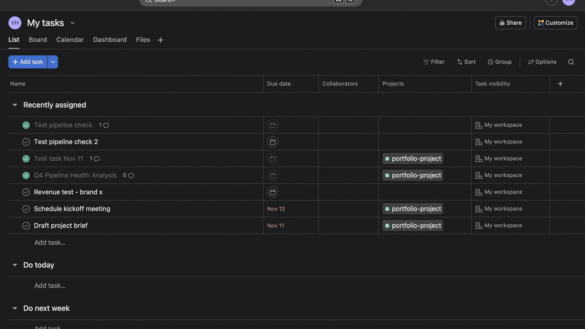
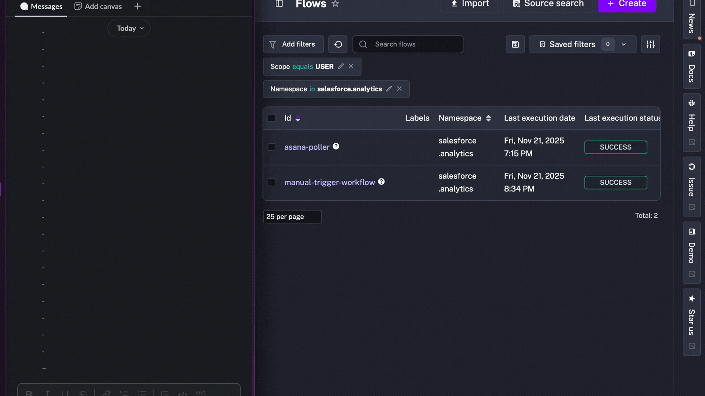
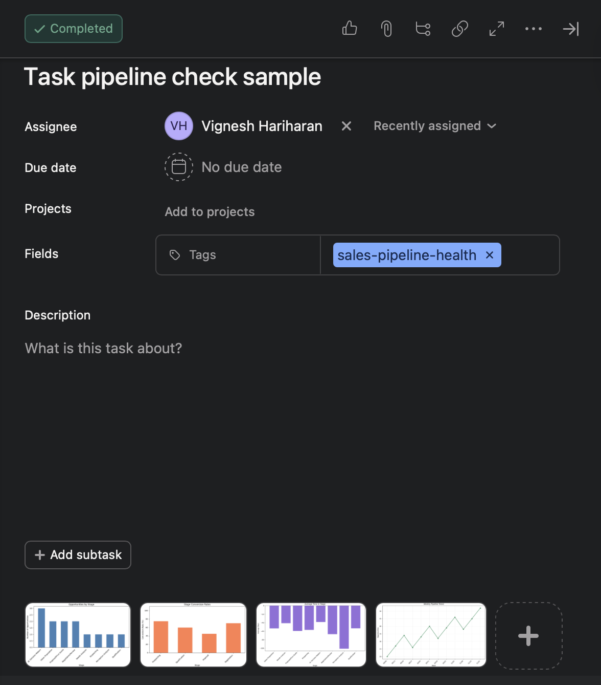

# Salesforce Opportunity Analytics Pipeline

An event-driven reporting pipeline for Salesforce opportunity data. Tagging an
Asana task triggers a Kestra workflow that extracts opportunities from the
Salesforce API, loads raw tables in Snowflake, transforms them with dbt into
analytics marts, renders four charts with matplotlib, and delivers the results
to Slack and back to the Asana task.

Built as a proof of concept to show end-to-end pipeline design: batched API
extraction, idempotent `MERGE` loads into a raw landing layer, governed metric
derivation in dbt (funnel, time-in-stage, forecast weights), a single
parameterized Kestra subflow with a scheduled poller and a failure handler, plus
unit tests and CI.

**What this demonstrates:** orchestration (Kestra), ELT with dbt on Snowflake,
API extraction with batching, idempotent loads, metric derivation in SQL, and a
tested, CI-checked codebase.

An optional final step asks an LLM for a one-paragraph commentary per chart. It
is a thin enrichment layer — the numbers come from SQL, and the pipeline runs
fine without it (see [Optional LLM commentary](#optional-llm-commentary)).

## Demo

### Creating an Asana task


### Workflow execution and Slack notification


### Completed Asana task


## Architecture

```
Asana task (tag)
   │
   ▼
asana-poller (Kestra, every 6h)  ──►  list matching tasks
   │
   ▼  per task, as a Subflow call
analytics-workflow (Kestra)      ──►  python/main.py <workflow_type>
   │                                       │
   │                                       ├─ Salesforce: Opportunity, Task, OpportunityHistory
   │                                       ├─ Snowflake: MERGE into raw_* landing tables
   │                                       ├─ dbt: staging → marts (metrics, funnel, forecast)
   │                                       ├─ matplotlib: 4 charts (reads marts)
   │                                       ├─ (optional) LLM commentary per chart
   │                                       ├─ Slack: structured notification
   │                                       └─ Asana: chart attachments + comment + complete
   │
   ▼  on failure
analytics-failure-handler (Kestra)  ──►  Slack alert + Asana failure comment
```

The three per-workflow YAML flows that used to duplicate this boilerplate have
been collapsed into a single parameterized subflow (`analytics-workflow`).
Both the scheduled poller and the manual trigger call the same subflow.

## Workflows

| Asana tag                | Charts produced                                                                                                  | Use case                       |
|--------------------------|-------------------------------------------------------------------------------------------------------------------|--------------------------------|
| `sales-pipeline-health`  | Stage distribution · stage-to-stage conversion (from `OpportunityHistory`) · time per stage · 12-week new-opp trend | Identifying bottlenecks        |
| `rep-performance`        | Close rate by rep · avg deal size by rep · activities vs. outcome · activity distribution                          | Coaching, performance reviews  |
| `revenue-forecast`       | Pipeline waterfall · stage win-probability (historical with default fallback) · revenue trend · pipeline age      | Forecast review, board prep    |

### How conversion is computed

Stage-to-stage conversion uses `OpportunityHistory` rows from Salesforce
(loaded to `raw_stage_history`, modeled through dbt into `fct_stage_conversion`),
so each conversion percentage is a real ratio of unique opportunities that
*reached* one stage to those that also *reached* the next. No interpolated or
hard-coded values.

### How the forecast weights are computed

Win probability per stage is modeled in dbt (`fct_stage_win_probability`) as
`won / closed` from historical opportunities that ever entered that stage.
Stages with fewer than ten closed opportunities fall back to documented defaults
from the `default_stage_weights` seed; the chart and Slack message both flag
which stages used the fallback so the number is never confused with a fitted
estimate.

### Optional LLM commentary

After the charts are rendered, an optional step sends them plus the SQL metric
summary to the Gemini API (`gemini-2.5-flash-lite`) and asks for one short
`Finding / Impact / Action` paragraph per chart. This is the only part of the
pipeline that touches a model, and it is deliberately non-critical:

- If `GEMINI_API_KEY` is unset, the step is skipped.
- If the API call fails, the run logs a warning and continues.

Either way the metrics, charts, Slack message, and Asana delivery are unaffected
— the commentary is narrative on top of numbers that are already final.

## Tech stack

- **Kestra** — orchestration (subflow + ForEach + failure handler)
- **Salesforce REST/SOQL** — `Opportunity`, `Task`, `OpportunityHistory`
- **Snowflake** — raw landing tables + dbt marts + `pipeline_runs`
- **dbt** — staging, intermediate, and mart models with schema tests
- **Python 3.11** — pandas, matplotlib, simple-salesforce, snowflake-connector-python
- **Slack** — structured incoming-webhook notifications
- **Asana** — request intake (tag-based) and result delivery
- *Optional* — LLM chart commentary via the Gemini API (`google-genai`); skipped cleanly when no key is set

## Setup

### 1. Prerequisites

- Docker Desktop
- Salesforce org with `OpportunityHistory` enabled (default for standard editions)
- Snowflake account
- Slack incoming-webhook URL
- Optional: Asana account + PAT + project GID
- Optional: Gemini API key (enables the LLM chart commentary)

### 2. Configure secrets

There are two `.env` files because there are two execution paths:

| File                | Used by               | Format                                            |
|---------------------|-----------------------|---------------------------------------------------|
| `.env`              | local `python main.py`| Plain values, no prefix                           |
| `.env.docker`       | docker-compose / Kestra | Base64-encoded values prefixed `KESTRA_SECRET_*` |

```bash
cp .env.example         .env          # local Python
cp .env.docker.example  .env.docker   # docker-compose
```

Then fill them in. The Kestra flows decode the base64 values at task start.
Base64 is encoding, not encryption — both files are gitignored, but the
`.env.docker` form is no more secure than `.env`.

`.env.docker` also carries three plain (non-base64) values that configure the
local stack rather than the pipeline: `KESTRA_BASIC_AUTH_USERNAME` (a valid
email), `KESTRA_BASIC_AUTH_PASSWORD`, and `KESTRA_DB_PASSWORD`. The compose
file falls back to weak defaults when they are unset, so set them before
exposing the stack beyond localhost.

### 3. Create Snowflake objects

```bash
snowsql -f sql/setup_snowflake.sql
# or paste it into the Snowflake UI
```

### 4. Create the three Asana tags

`sales-pipeline-health`, `rep-performance`, `revenue-forecast` (lowercase, exact).

### 5. Start Kestra

```bash
cd docker
docker compose up -d
open http://localhost:8080
```

Kestra requires Basic Authentication; log in with the
`KESTRA_BASIC_AUTH_USERNAME` / `KESTRA_BASIC_AUTH_PASSWORD` values from
`.env.docker`. The UI and API are bound to `127.0.0.1` only — put the stack
behind an authenticating reverse proxy before exposing it to a network.

In the Kestra UI, create the four flows under the `salesforce.analytics`
namespace:

- `kestra/flows/analytics-workflow.yml`
- `kestra/flows/analytics-failure-handler.yml`
- `kestra/flows/asana-poller.yml`
- `kestra/flows/manual-trigger-workflow.yml`

## Usage

### Scheduled (every 6 hours)

Tag any incomplete Asana task in the configured project with one of the three
workflow tags. The next poll picks it up, runs the analysis, attaches the four
charts, posts the structured Slack message, and marks the task complete.

### Manual

In the Kestra UI run `manual-trigger-workflow`, pick one or more workflow
types, optionally pass an Asana task GID + URL, and execute.

### From a developer's machine

```bash
cd python
python -m venv .venv && source .venv/bin/activate
pip install -r requirements-dev.txt
python main.py sales-pipeline-health           # no Asana side-effects
python main.py revenue-forecast <task_gid> <task_url>
python main.py sales-pipeline-health --skip-ai # metrics + charts only, no LLM step
```

## Data model

### Raw landing (Python MERGE)

| Table               | Purpose                                                         |
|---------------------|-----------------------------------------------------------------|
| `raw_opportunities` | Current Salesforce opportunity snapshot per run.                  |
| `raw_activities`    | Linked `Task` rows per opportunity.                             |
| `raw_stage_history` | `OpportunityHistory` transitions.                               |
| `pipeline_runs`     | Run audit log: status, records processed, error text, optional LLM token/cost. |

### dbt marts (workflows read these)

| Model                         | Purpose                                                                |
|-------------------------------|------------------------------------------------------------------------|
| `fct_opportunities`           | Opportunity grain with `days_open`, `days_to_close`, `total_activities`. |
| `fct_pipeline_summary`        | Single-row pipeline health headline metrics.                           |
| `fct_pipeline_stage_metrics`  | Open pipeline by stage.                                                |
| `fct_stage_conversion`        | Funnel conversion percentages from stage history.                      |
| `fct_stage_duration`          | Average days per stage.                                                |
| `fct_stage_win_probability`   | Governed win probability with historical/default flag.                 |
| `fct_revenue_forecast`        | Weighted forecast by open stage.                                       |
| `fct_rep_performance`         | Closed-opportunity metrics per rep.                                    |

## Tests

```bash
cd python
pip install -r requirements-dev.txt
pytest
```

The suite covers the parts most likely to drift silently: Slack insight
parsing, retry semantics, prompt rendering, environment-variable fallback,
and revenue-forecast metric assembly from dbt marts. CI runs `ruff`, `pytest`,
`dbt parse`, and a YAML lint over the Kestra flows on every PR.

## Project layout

```
.
├── .github/workflows/ci.yml
├── dbt/                                # dbt project (staging → marts)
├── docker/docker-compose.yml
├── kestra/flows/
│   ├── analytics-workflow.yml          # parameterized subflow
│   ├── analytics-failure-handler.yml   # Slack + Asana alert on failure
│   ├── asana-poller.yml                # 6h schedule, dispatches via subflow
│   └── manual-trigger-workflow.yml
├── python/
│   ├── clients/                        # salesforce, snowflake, gemini, slack, asana
│   ├── workflows/                      # one module per analysis type, plus shared extract/load
│   ├── config/                         # settings + prompts
│   ├── utils/                          # logger, retry, dbt runner, chart cleanup
│   ├── tests/
│   ├── main.py
│   ├── requirements.txt
│   └── requirements-dev.txt
├── sql/setup_snowflake.sql
└── outputs/charts/                     # generated PNGs (gitignored, pruned after 7 days)
```

## Operational notes

- Runs use the most recent 90 days of opportunity data.
- Snowflake warehouse: `X-Small`, auto-suspend 60s.
- Salesforce SOQL `IN (...)` is batched at 200 IDs per request to stay well
  under the 100 KB query limit.
- Snowflake MERGE statements use `executemany` in 500-row batches.
- A failed Kestra execution invokes the `analytics-failure-handler` subflow,
  which posts the workflow type, execution ID, and error to Slack, and (when
  triggered by a tagged task) leaves a failure comment on the Asana task.
- All credentials are read from `.env` / `.env.docker`, neither of which is
  committed.

## License

MIT
